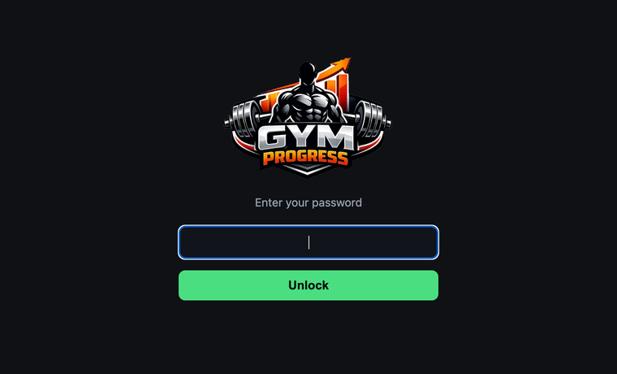
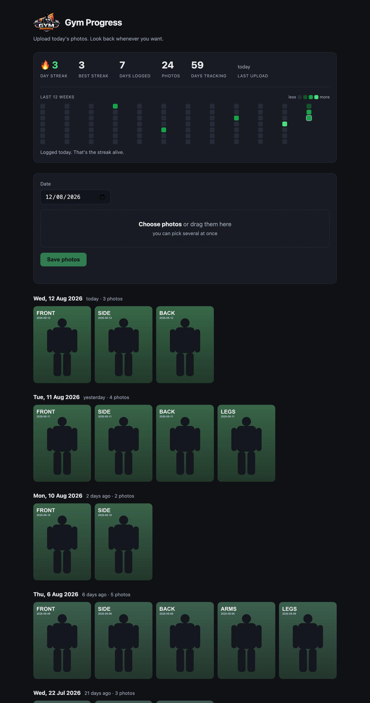

# Gym Progress

Upload a set of photos each day; the page turns them into a streak tracker and a
day-by-day timeline. Photos live in a private Supabase Storage bucket (`gym-photos`),
one folder per date.

## What it looks like

The site opens locked. One shared password, set as an environment variable.



Once unlocked: streak stats and a 12-week calendar on top, the upload card, then every
day you've logged, newest first. Same pose order each day, so comparing a column top to
bottom is the progress check.



*(The photos above are generated placeholders, not real progress pics.)*

## Deploy to Vercel

1. Push this folder to a GitHub repo. `.env` is gitignored — check that it did **not** get
   committed, since it holds your Supabase secret key:

   ```
   git init && git add -A && git commit -m "gym progress tracker"
   git status --short          # .env must not appear
   ```

2. On Vercel: **Add New → Project → Import** the repo. Leave every build setting alone —
   no framework, no build command. `vercel.json` handles the rest.

3. Before the first deploy, add three **Environment Variables** (all environments):

   | Name | Value |
   |---|---|
   | `SUPABASE_URL` | `https://abemsnqunjxffrimkbmf.supabase.co` |
   | `SUPABASE_SECRET_KEY` | your `sb_secret_…` key |
   | `USERS` | your accounts — see below |

4. Deploy, open the URL, enter a password. It's remembered on that device.

If you skip `USERS`, **the site is open to anyone with the URL** — including the
upload and delete endpoints. Always set it in production.

## Accounts

Several people can share one deployment. Each gets their own password, their own photos,
and their own accent colour:

```
USERS=alice:alice-password:#4ade80,bob:bob-password:#60a5fa
```

`name:password:accent`, comma separated. The accent is optional — omit it and one is
picked from a default palette. Names allow letters, digits, `_` and `-`; passwords must
not contain a comma or colon. Add or remove people by editing the variable and redeploying.

**How the isolation works.** Each account owns a folder, `gym-photos/<name>/YYYY-MM-DD/`.
The folder prefix is derived server-side from whichever account the password resolves to —
the browser never names a user, so there is no parameter to tamper with. Asking for
another account's photo by filename returns 404, and deleting one does nothing.

Signing in as a different account changes the name in the header and recolours the streak
figures and calendar. **Sign out** clears the stored key on that device.

Because passwords *are* the identity, two accounts must never share one. Changing a
password signs that person out everywhere; changing a *name* points that account at a new
empty folder, so rename only if you mean to.

## Run locally

```
node server.js          # reads .env, serves http://localhost:4321
```

The local server runs the same `api/*.js` handlers Vercel does, so local behaviour
matches production.

## How it works

- **Upload** — the date box defaults to today. Pick photos (or drag them in) and hit Save.
  Each photo is shrunk in the browser to max 1600px JPEG before upload, so a 5MB phone
  photo lands around 300KB. They upload one per request, since hosted functions cap
  request bodies at 4.5MB.
- **Storage** — `gym-photos/<user>/YYYY-MM-DD/<timestamp>.jpg` in a **private** bucket.
  Images are proxied through `/api/image`, so no photo of yours sits on a public URL.
- **Tracker** — current streak (counts today or yesterday as the endpoint, so an unfinished
  day never zeroes it), best streak, days logged, total photos, days tracking, and a
  12-week calendar grid shaded by how many photos each day has.
- **Auth** — a password maps to an account in `USERS`. The browser sends it as a header on
  API calls and as a cookie for `` requests, which cannot carry headers.

## Layout

```
api/
  days.js     GET    list every day with photos, newest first
  upload.js   POST   save one photo  { date, dataUrl, seq }
  photo.js    DELETE remove one photo  ?date=&file=
  image.js    GET    proxy a photo out of the private bucket
  me.js       GET    which account the caller is, and its accent colour
lib/store.js  accounts, the password check, and every Supabase call
public/
  index.html  the entire frontend
  logo.webp   the logo, used in the header and on the password screen
  icon.png    favicon / home-screen icon
server.js     local dev server, runs the same handlers
vercel.json   static root + the /uploads/:date/:file rewrite
```

No npm dependencies — it runs on Node's built-in `fetch` and `http`.
